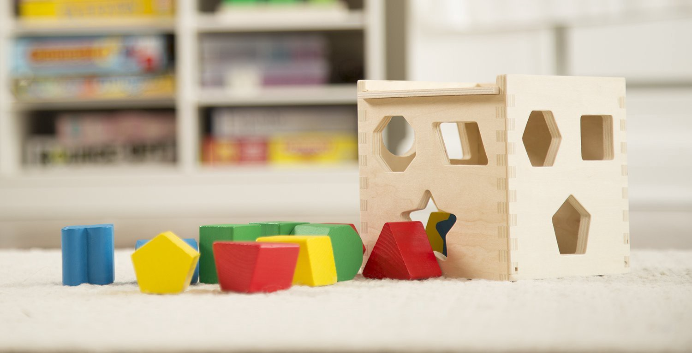
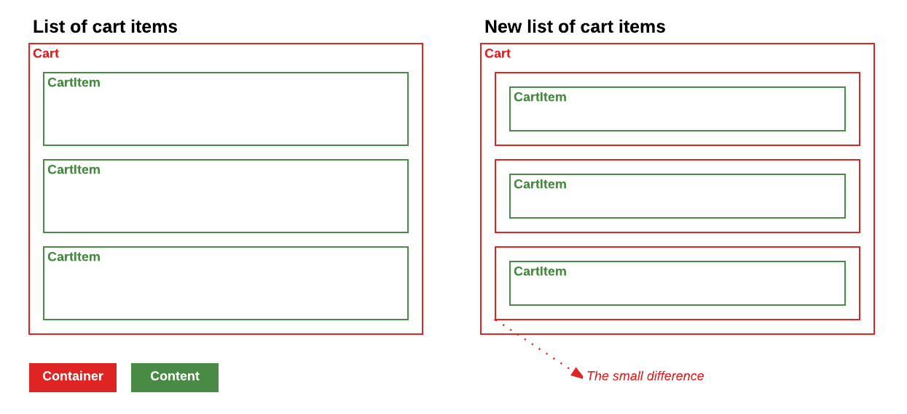
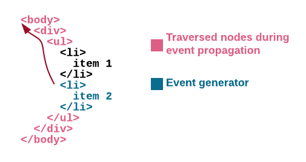

I'm sure that you played this game hundred of times when you were a kid. At
that time you learned how to fit a different kind of shapes in their
corresponding places. This game is going to be a good metaphor for the next
story.

I'm going to go through one example to know how to identify you are mixing
responsibilities between components and how to enforce the [single responsibility principle](https://en.wikipedia.org/wiki/Single_responsibility_principle).
When we are going to highlight the figures of what is content and what is a
container.

Falling into this bad pattern of mixing responsibilities can impact in many
components in your source code not only in your component style but even in
your component logic. The main goal is to get better components in terms of
reusability. I'm going to use this example to analyze it in terms of:

- Components styling (UI)
- Component business logic (UX)

All the examples presented in this post are based on React classes and JSX markup but those advice apply for whatever technology you use.

## List of cart items

Imagine a list of items in your cart. We have three items in our cart, two of
them are selected and one of them is a _premium_ item. Each item has a button
to let the user remove items from the cart.

An easy example for it could be something like this:

```html
<ul class="cart">
  <li>
    <header>Item 1</header>
    <p>Lorem ipsum dolor sit amet, consectetur adipiscing.</p>
    <button>Remove from cart</button>
  </li>
  <li class="premium selected">
    <header>Item 2</header>
    <p>Fusce vel neque sit amet felis fermentum cursus vitae.</p>
    <button>Remove from cart</button>
  </li>
  <li class="selected">
    <header>Item 3</header>
    <p>Vel neque sit amet vitae suscipit nibh.</p>
    <button>Remove from cart</button>
  </li>
</ul>
```

And the stylesheet something like this:

```css
.cart {
  border: 1px solid #ddd;
}

.cart li {
  margin-bottom: 10px;
  border: 1px solid red;
}

.cart li.selected {
  background-color: blue;
}

.cart li.premium {
  font-weight: bold;
}
```

When you start trying to convert this layout in components the first approach
that comes to your mind is something like:

```jsx
class CartList extends React.Component {

  onClickItem(event, index) {
     this.state.setState({
        selected: [
           ...this.state.selected,
           index
        ]
     });
  }

  onClickRemove () {
    // Go to your store and remove item
  }

  renderCartItem(item, index) {
    const isPremium = item.premium ? 'premium' : '';
    const isSelected = this.state.selected.indexOf(index) >= 0 ? 'selected' : '';

    return (
      <li className={`${isPremium} ${isSelected}`} onClick={(event) => this.onClickItem(event, index)}>
        <header>{item.title}</header>
        <p>{item.description}</p>
        <button onClick={this.onClickRemove}>Remove from cart</button>
      </li>
    );
  }

  render() {
    const { items } = this.props;

    return (
      <ul className='cart'>
        {items.map((item, index) => this.renderCartItem(item, index)}
      </ul>
    );
  }
}
```

_An example of mixed responsibilities_

This list will be the `CartList` component and the `renderCartItem` is going
to render `li` nodes with all the required stuff for each item in the list
with all the required classes to show all the selected items.

Maybe at that point you don't see the problem but sooner than later you will
start facing problems regarding this decision.

A few weeks later, you get new requirements for your cart. Users should be able
to multiselect items in this list. You start implementing this feature and you
start needing some way to communicate between items to know if they are
selected, sending events, toggling classes in the item, etc.

Wait a minute, this is going crazy…

If you reuse those items in another place in your application, maybe you don't
want the selection behaviour and you start adding more and more conditionals to
choose which are the behaviours you want for all the places they are used. Do
you want to add the selectable behaviour to a list of Order, but this one is
`CartItem` types?

So, the answer for including this behaviour in the item is probably no.

Now, stop for a second and think in terms of containers and content. Which are
the container and the content for this layout?


### New list of cart items

It's really good when you start building a structure of components to think
about which is the responsibility for each one in terms of reusability.

Differentiate content from containers. Ask yourself:

- Are those items responsible for managing the selection in this list?
- Which is the best place to put a handler for managing the selection?

It's easy to change your mind and start seeing them from another point of view.
Imagine a component `SelectableList` and `CartItem`. Let's check a new approach
with this layout:

```html
<ul>
  <li>
    <div>
      <header>Item 1</header>
      <p>Lorem ipsum dolor sit amet, consectetur adipiscing.</p>
      <button>Remove from cart</button>
    </div>
  </li>
  <li class="selected"> <!-- More clear responsibilities (SelectList) -->
    <div class="premium"> <!-- More clear responsibilities (CartItem) -->
      <header>Item 2</header>
      <p>Fusce vel neque sit amet felis fermentum cursus vitae.</p>
      <button>Remove from cart</button>
    </div>
  </li>
  <li class="selected">
    <div>
      <header>Item 3</header>
      <p>Vel neque sit amet vitae suscipit nibh.</p>
      <button>Remove from cart</button>
    </div>
  </li>
</ul>
```

_New cart markup, with better responsibilities_

The differences are subtle, but you will start taking advantage of them.



### Components styles

A common pattern to know you are mixing responsibilities between components is
if you are abusing of `margin` CSS rule. Content components should expand as
much as possible and should not be aware of the surroundings. Container
components are the right ones for managing the space between content
components, and you can achieve that with `padding` CSS rules.

```css
.selectable-list {
  border: 1px solid #ddd;
}

.selectable-list li {
  padding-bottom: 10px; /* margin to padding ;) */
}

.selectable-list .selected {
  background-color: blue;
}
```

As you can see we moved the `margin-bottom` rule from the cart item to a
`padding-bottom` rule in `selectable-list`.

**Try to convert component margins to paddings**

When you start using this approach you will discover that specs like [flexbox](https://developer.mozilla.org/en-US/docs/Web/CSS/CSS_Flexible_Box_Layout/Using_CSS_flexible_boxes)
fit much better with all your requirements.

### Components business logic

One of the most interesting features from DOM and of the most misunderstood is
the event bubbling. When you understand how it works and which are the main
topics you need to take care of is when you all this new component structure
shines.

A brief summary for event bubbling is that an event that happens in a DOM node
goes through all the parent nodes until you call `stopPropagation` method.



Taking this as premise, it's really easy to share all the responsibilities out
in our application between all the components in it.

If you think about who is the responsible for managing the selection, now the
answer is really easy. It must be the `SelectableList`.

**SelectableList:**

```jsx
class SelectableList extends React.Component {

  onClickItem(event, index) {
     this.state.setState({
        selected: [
           ...this.state.selected,
           index
        ]
     });
  }

  render() {
    return (
      <ul>
        {items.map((item, index) => {
          const isSelected = this.state.selected.indexOf(index) >= 0 ? 'selected' : '';

          return (
            <li key={index} className={isSelected} onClick={(event) => this.onClickItem(event, index)}>
              {renderItem(item)}
            </li>
          );
        })}
      </ul>
    );
  }
}
```

**CartItem:**

```jsx
class CartItem extends React.Component {
  onClickRemove () {
    // Go to your store and remove item
  }

  render() {
    const { item } = this.props;
    const isPremium = item.premium ? 'premium' : '';

    return (
      <div className={isPremium}>
        <header>{item.title}</header>
        <p>{item.description}</p>
        <button onClick={this.onClickRemove}>Remove from cart</button>
      </div>
    );
  }
}
```
_CartItem component knows nothing from SelectableList component_

The really cool thing about this is that now the responsibilities are really
clear, and both components can evolve without clashing between them. Do you
want to add multiselection in `SelectableList`? Go for it. Are you adding new
stuff to `CartItem`? No problem.

In terms of component logic, play with event bubbling to decide who is the
owner for each event is generated in the application. If you think an event
should not go through upper components, stop it with `stopPropagation` method.

If you find yourself trying to disable some specific zone in your component,
you can take advantage of [`pointer-events`](https://developer.mozilla.org/en/docs/Web/CSS/pointer-events)
property to have a better control over what is clickable.

## Conclusion

You can extrapolate those examples to hundreds of use cases. The result will be
a really good set of reusable generic components and a set of easy components
linked to your business logic.

With this set of generic components, is easier to apply improvements to
accessibility in your application. This will step your application up in terms
of quality adding value to many parts of it at once.

Try to think in containers and content every time you are creating new
component and you will be able to figure out the best for you!
