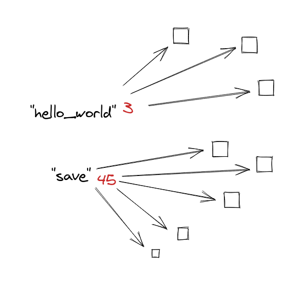

Everybody is familiar with
[DRY](https://en.wikipedia.org/wiki/Don%27t_repeat_yourself) principle in
software engineering coined by Andy Hunt and Dave Thomas. It states *do not
repeat yourself* in code to achieve less ambiguous code, avoid redundancy, and
many other benefits in the long term.

In this post, I want to explain another pattern that I see over and over in any
kind of projects and it only brings problems in the long term and impacts the
maintainability of your software project. It doesn't affect the source code
itself but in the organization of the files that compose it.

# What is a leftover?

Over months and years, projects create and destroy many pieces of software
as they keep evolving to meet users' expectations. During this period of
time is easy to generate files, components, and other kinds of stuff that are not
used any more. Those non desired pieces make harder to maintain, impact in your
internal metrics, slow down your Continuous Integration check and other kinds
of side effects.

Those leftovers from the past don't bring any value to the project and in the
long term they can reach a point where nobody is brave enough to do a right
cleanup to have a healthy codebase. This goes directly to the technical debt
bucket.

Those items should have been removed when the last reference to them disappeared
but a developer forgot to remove them. Those leftovers can be a non used
image, a non used copy, a non used test in your test suite, etc. This bad
pattern can take many shapes.

You can find many similarities and parallelisms with the responsibilities of a
memory garbage collector. It keep tracks the dependencies between parts, with
a [reference counting](https://en.wikipedia.org/wiki/Reference_counting) to be
able to destroy a non used references. The problem here is that we
don't track this kind of information between the dependencies in our code base.

# Why we create leftovers?

This bad design pattern can show up in many shapes. This is another example
where *Don't create leftovers* impacts many projects today. How many of you
have a translation system where translations live in one place and the place
where they are used is in another one?

`src/translations/en.json`
```json
{
  "hello_world": "Hello World!"
}
```

`src/components/hello_world.jsx`

```js
export default function HelloWorld () {
  return (
    <div>{i18n.t('hello_world')}</div>
  )
}
```

The problem with this translation approach is that if the `HelloWorld`
component disappears in the future, the copy in `en.json` will be forgotten unless
a developer remembers to clean it up. At some point in the future, your
main translation file start to have hundreds of unused keys that make you lose
money with each new language you want to support.



Some [translation systems](https://formatjs.io/docs/getting-started/message-extraction)
are aware of this and follow a much better approach. They have an *extraction*
step to retrieve all translations from the codebase. With this, the list of
used copies (dependencies) is always up to date.

# Other examples

How many times have you seen a web platform tutorial where the `assets` folder
and the place where they are used is far away?

Take this easy file structure:

```
/assets/images/
  - post1-cover.jpg
  - post1-thumbnail.jpg
/posts/post1/
  - helper.js
  - index.jsx
/specs/
  - helper.spec.js
```

This structure can be familiar to you, but it suffers from DCL. If for some
reason the `post1` is no longer needed and it disappears, it is really
provable that the `helper.spec.js` file will be removed after a failing test but
those `assets` related to `post1` will be forgotten forever.

Check this other example:

```
components/
  List/
    index.jsx (has a dependency with ListItem)
  ListItem/
    index.jsx
stories/
  List.story.jsx
```

Although this file organization seams inoffensive, it suffers from DCL too. If
the `List` component disappears, maybe the `List.story.jsx` will fail as a
side-effect but nobody will alert you that `ListItem` needs to
be removed too.

# How to detect it?

This principle shows up like references to parent components or external
resources, but sometimes it is harder to detect it.

The rule of thumbs in all cases is to answer yourself the question:

*If I remove this component or piece of code from my code base, will I create leftovers?*

With this question, you imagine yourself in the future removing this shiny new
code and seeing all the unused pieces in your source code. Answering this
question at this point helps you to know all the dependencies this code has.

# Better approach

To fix this organization problem, the best approach is to encapsulate better
all the dependencies. In the case of file, structures try to avoid having
dependencies to parent components if a dependency is only used once and move
them as child components. All those dependencies can start to use relative
paths.

Following the previous example, this would be a much better organization:

```
/components/
  List/
    ListItem/
      index.jsx
    index.jsx
    index.story.jsx
```

This new approach has much better encapsulation and a clear set of
dependencies. One direct benefit of this is that it let you move this component
to others around without break it.

In some cases, like the translations example, you will need some extra step in
your toolchain to resolve those dependencies of your views. In the case of the
assets one, you will need your builder (Ex. Webpack) to have support to resolve
them.

# Conclusion

We just reviewed few examples of the *don't create leftovers* principle.
Understanding the consequences in terms of maintainability, you will be able to
create and organize your components in a better way that will let you
maintain your code base in a healthier way in the long term.

You don't need to take this principle as written in stone. There are always
exceptions or corner cases, as in DRY principle, we don't have to fall on *the
wrong abstraction* as Sandi Metz mentioned. You have to use it and keep it
in mind when you structure your components, views, assets or
whatever piece in your project.

I hope this post helps you to spot this pattern sooner than later to keep the
maintainability of your project under control.

Happy hacking!
