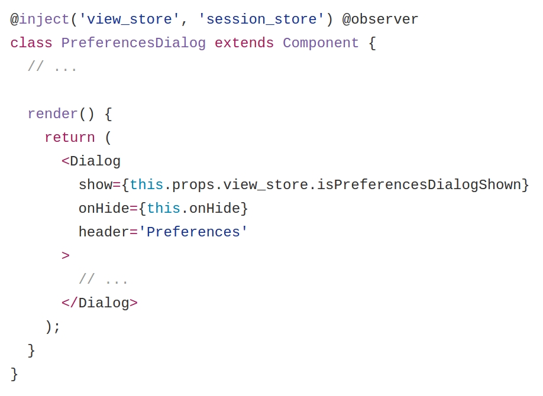
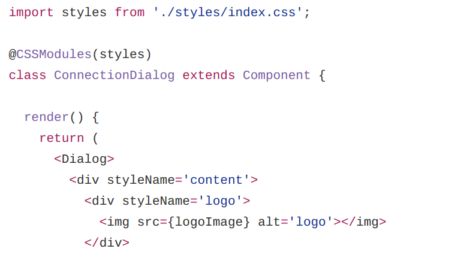
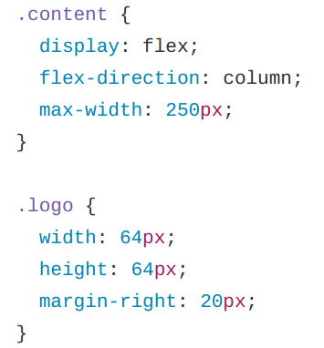
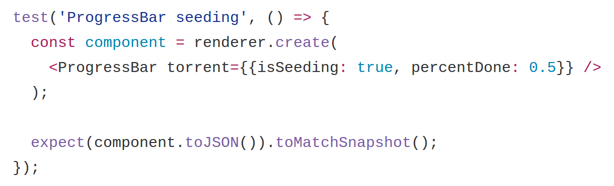
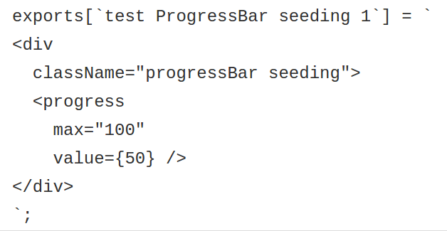
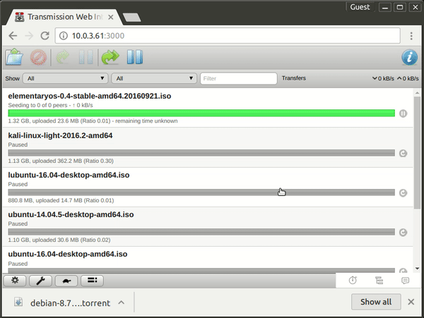

I remember it was about two months ago when I was talking with Eduardo
Lanchares about the best stack for the next webapp. Sometimes you are at work
and you are stuck with the current set-up of frameworks and tools that are
quite difficult to change or refactor. This forces you to always work with the
same mentality not allowing you to test new approaches to solve problems.

Following our desire to learn new stuff to make our life easier, we wanted to
experiment with new technology to build a side project with a complete new
stack that fits better with the app requirements.

In that same week, a friend of mine was talking about a bug that was affecting
him in the web client of Transmission. This [bug](https://trac.transmissionbt.com/ticket/5857)
was affecting more people because we found an open bug report in the tracker
that was 2 years old. We decided to check the source code and try to fix it
because we thought that would be a piece of cake. But a few hours later we
discovered that was not as easy as we expected and at some point we gave up.

With all these things in mind we had the perfect scenario and excuse to start
playing with a new side project. We decided to start building a new interface
from scratch to understand new patterns, new approaches and discover what would
be the next challenges for the _ultimate interface_.

## Our experimental stack

Reviewing all of the features in the current Transmission web client, the stack
we chose was React for the user interface, Mobx for the state management and
CSS modules for all the stuff related with the application styles, with a new
build process managed by Webpack.

On the other hand, and with the above stack in mind, we decided to use some
best practices for the long term quality of this project. Some of these were
things like a strict set of Eslint rules, unit tests, UI tests and
internationalization.

With this decision we wanted to achieve a more reliable interface, better
performance, security and correctness. In conclusion a better way to maintain
this web application.

In the following sections we are going to go through a list of differences
between the way of developing the original Transmission source code and our
approach. If you are curious, you can check the [original
code](https://github.com/transmission/transmission/tree/master/web) and [our
code](https://github.com/fcsonline/react-transmission).

## Components

In terms of application modularization, the original client was implemented
with a set of _views_ joined in a single static HTML file. These views were
modified by jQuery code to keep it updated. While this approach worked as
expected, it had the disadvantage of generating multiple DOM updates, which
impacted UI performance. Also, having hard-coded strings in this file made it
difficult for supporting I18n as well as dynamic content generation (for
instance when displaying available [speed limits](https://github.com/transmission/transmission/blob/master/web/index.html#L380))

Our new application stores each component in an independent folder for each of
them, with all the related stuff within. Things like styles, tests or
subcomponents live together. This lets us manage all the application components
understanding all the dependencies between them and achieving the best
decoupling possible.

## State management

In a traditional web application implemented with jQuery you would keep
updating all the UI manually, after realizing that some elements were outdated.
Those changes would usually come from some user interaction or from server
updates, so the concept of application state was almost inexistent.

With the new stack managed by React and Mobx, we follow the one way data flow
convention, which makes it easier to reason about the application state. All
this state is managed in Mobx containers called stores. This is a really good
diagram to understand how it works:

Mobx uses the following main concepts to model your application state:

- `observable` properties: basic tracked properties
- `computed` properties: derived properties from observable ones
- `actions`: methods to update the state
- `reactions`: side effects to be executed for each state change

For instance, in the following example, when we click on the preferences
button, we dispatch an action that updates the `isPreferencesDialogShown`
observable property. That change produces an update in observer components. In
this case `PreferenceDialog` reacts to this change and re-renders itself,
resulting in dialog shown in the UI.

## Styling

For a really long time we have been styling HTML components through a list of
CSS classes referenced by class attributes in your elements. New tools have
appeared during the last 5 years to improve our life like SASS, LESS or CSS
Modules.

If you are used to code big sets of components you can make the common mistake
of reuse style classes for different components. But what happens when the
styles from those components start to differ? You are in a trouble.

As we said before, in our stack we decided to use CSS Modules to style all our
components. We think that this is the best approach to achieve a modular and
reusable set of classes. All the required classes for each component live
together. This is really good in terms of maintainability because it’s trivial
to decouple components. CSS Modules lets you play with composition so you get
the best characteristics from both worlds.

As you can see in the following example we are using two CSS modules references
called `content` and `logo`. These names are used to refer classes in the
stylesheet file.

React `viewConnectionDialog/index.js`:

Style `fileConnectionDialog/styles/index.css`:

## Tests

The original application had no tests at all so it was easy for us to improve
that aspect.

In the new application we wanted to test not only business logic but also the
UI. For this we opted for the [Jest](https://facebook.github.io/jest/)
framework and the _snapshot_ testing technique. With this we ensure every
component renders what’s expected. This is important because most of the
components contain several paths and we need to ensure that each one is
covered.

Integrating this new set of tests to some CI we can be more confident about
future changes that we apply to the application.

As we can see in this example we are rendering the Progress bar component with
mocked torrent data.

Then with the snapshot technique we can ensure that the rendered result is what
we expect comparing with previous snapshot. Testing components in this way is a
as simple as record JSX code.

## Extra features

Reviewing all available features in the original Transmission web interface we
discovered broken features like Desktop notifications. We wanted to restore
them because we think it’s a really nice feature to have.

Furthermore, one extra feature that the new interface includes is drag and drop
file support for torrent files. This boosts the common use case of quickly
adding a torrent file as you can see in this example:

## Conclusion

We started this project to play with new technology to be able to understand
all the challenges a bigger project would face if you chose some specific
stack. At some point we saw how easy was to implement new features that were
included in the original interface. So we decided to push forward and set a
personal goal: Implement all of them. Today we can say that we’ve achieved 95%
of all features.

Our last goal is to present this project to the community to be evaluated. We
decided to respect as much as possible the original interface for two main
reasons:

- We didn’t want to raise a debate in UI design. So we decided to follow the current design, we just wanted to propose a new code architecture.
- We didn’t want to impact the end users in case that this code were considered for inclusion in the main Transmission repository.

Lastly, even if the project dies out, for whatever reason, we’re happy anyway,
because we learnt a lot of things and had a really fun time during its
development. :D

